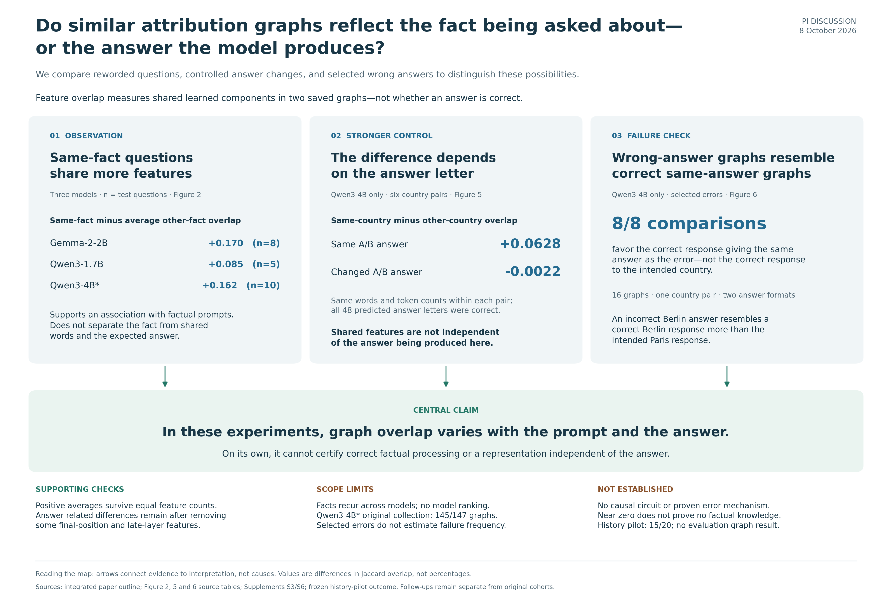

# Attribution graph paper review package

Updated 8 October 2026. This is a working paper for PI and collaborator review, not a peer-reviewed publication or a submission-ready release.

## Research question

Do similar attribution graphs reflect the fact being asked about—or the answer the model produces?

In these experiments, graph overlap varies with the prompt and the produced answer. It cannot, by itself, establish correct factual processing or an answer-independent representation.

## Start here

1. [Claims map](claims/paper_claims_map.png) — the three main findings and their limits. [Editable SVG](claims/paper_claims_map.svg).
2. [Findings and changes](manuscript/FINAL_FINDINGS_SUMMARY.md) — what changed and what the data support.
3. [Integrated outline](manuscript/INTEGRATED_PAPER_OUTLINE.md) — the argument and planned section structure.
4. [Current figure guide](figures/LEGENDS.md) — six main figures and six supplements with self-contained captions. Open [the figure gallery](figures/index.html) locally in a browser.
5. [Working manuscript](manuscript/ATTRIBUTION_GRAPH_THREE_MODEL_DRAFT.md) — this sharing copy incorporates the current figures and captions. The prose remains a draft. A [browser-readable copy](manuscript/ATTRIBUTION_GRAPH_THREE_MODEL_DRAFT.html) is included for local viewing.
6. [Questions included and excluded](manuscript/SAMPLE_ACCOUNTING.md) — counts and reasons, distinct from accuracy.

GitHub renders Markdown and PNGs directly. Download the folder to view the HTML galleries locally; GitHub does not render these HTML files as a hosted website.

## Figure 1 preferred layout

The preferred [option C](claims/figure1_option_c.png) includes the recorded failure prompt. It is retained as a clearly labeled layout alternative, not silently substituted into the main figure set. Its final promotion and caption reconciliation remain an author decision.

## Main findings and boundaries

- Included same-fact comparisons have positive average feature-overlap differences in three models: Gemma-2-2B, Qwen3-1.7B, and Qwen3-4B. The same facts recur across models, and subject coverage differs; this is not a model ranking.
- Stronger controls are Qwen3-4B only. Across six country pairs, the same-fact difference is 0.0628 with the same A/B answer and −0.0022 with a changed answer. Near zero does not prove absence of factual knowledge.
- All eight selected error comparisons favor the correct response giving the same answer over the correct response to the intended country. These dependent cases do not estimate general failure frequency or prove an error mechanism.
- The original Qwen3-4B collection remains incomplete at 145/147 graphs. The final history pilot passed 15/20 checks against a 20/20 gate, so no evaluation graphs were collected.

## What is in the folder

| Folder | Contents |
|---|---|
| `claims/` | Current claims map and preferred Figure 1 layout, PNG and editable SVG |
| `figures/` | Current six main figures, six supplements, captions, and local browser gallery |
| `tables/` | Figure source tables and question-inclusion audit |
| `manuscript/` | Working draft, integrated outline, findings summary, and sample accounting |
| `methods/` | Relevant frozen protocols and supporting analysis notes |
| `code/` | Selected analysis, figure, validation, and test source snapshots; dependency pins |
| `provenance/` | File checksums, source mapping, and archived verification evidence |

## Reproducibility and exclusions

The code snapshots preserve the original project-relative paths. They are for method inspection and use with the full authorized research archive; this compact folder does **not** reproduce the complete analysis by itself. Most original figure builders require saved analysis JSON files or raw graphs that are not redistributed here. The included CSV files support inspection of reported figure values, but do not replace the raw-data audit. No collection script has been run to prepare this package.

The archived 5 October same-machine reproduction passed 82 tests and reconstructed the 23 original margins. That is historical verification, not a new independent replication. Later figure wording checks are documented separately. `provenance/package_manifest.json` records checksums for this package; `provenance/link_audit.json` records portable-link checks.

To verify the downloaded files and headline arithmetic without installing additional packages, run `python code/verify_package.py` from this folder. This checks file hashes and the included tables, not the excluded raw graphs.

Excluded: raw Neuronpedia graph exports, tokenizer/model files, private API configuration, credentials, downloaded reference PDFs, environments, caches, unrelated project changes, and the large local-only release archive. Their redistribution permissions are not established. The earlier compiled PDF is omitted because its figures and captions predate this revision. Links to the original writing-reference papers appear in [the reference guide](methods/WRITING_REFERENCES.md); their PDFs are not bundled.

Independent scientific review, author approval, reference verification, and venue formatting remain outstanding. This package makes no new license grant for third-party materials and does not authorize redistribution of the excluded archive.
