This revision preserves the original three-model estimates and incomplete extension status, incorporates the separately frozen Qwen3-4B matched-choice follow-up, and adds exploratory failure-case and statistical audits. The final history pilot failed its behavioral gate and collection ended without evaluation graphs. The July manuscript, source data, and frozen protocols remain unchanged. No causal circuit recovery or answer-independent semantic representation is established.

> Sharing copy updated 8 October 2026: figures and captions match the current plain-language figure package. Scientific estimates and manuscript body are unchanged.

## Abstract

Attribution-graph feature overlap may reflect the fact being queried, prompt wording, or the answer being produced. We examined these alternatives in three model pipelines using factual paraphrases, nonce controls, and crossed fact-by-wording cohorts, followed by stronger controls in Qwen3-4B. Mean same-fact Jaccard margins were 0.170, 0.085, and 0.162 in the eligible Gemma-2-2B, Qwen3-1.7B, and incomplete Qwen3-4B extension cohorts. Positive pooled margins survived equal-feature-count subsampling, but the original comparisons did not separate factual identity from shared words and expected answers. A separately frozen Qwen3-4B follow-up crossed queried country, answer mapping, and wording with identical token inventories within each of six country-pair blocks. All 48 top-label decisions were correct. The balanced fact-associated contrast was 0.0303 (95% block-bootstrap interval 0.0265–0.0338), compared with a descriptive output-label contrast of 0.2827; the fact contrast was 0.0628 within the same label and -0.0022 when the label changed. A subsequent position-selection pilot failed its behavioral gate. In an exploratory 16-graph diagnostic of selected France/Germany cases, all eight ordinal-reference errors reproduced and all eight named-country controls remained correct. Every failure graph was more similar to a correct response producing the same output than to its correct intended-country counterpart. These results support feature overlap as a prompt- and answer-conditioned measurement, not a standalone indicator of correct factual processing or an answer-independent semantic circuit.

## 1. Introduction

Attribution graphs provide a prompt-specific representation of sparse features and their attributed influence. Such representations can generate mechanistic hypotheses, but similarity between their feature sets does not by itself validate a mechanism. The circuit-tracing methodology emphasizes interventions when interpreting graph-derived hypotheses [1]. Here we study a simpler measurement question: which prompt relationships are associated with feature overlap?

Targets and their factual paraphrases may overlap because they ask about the same fact, share entity words, lead toward the same answer, or produce similarly sized sparse representations. A crossed wording design can expose some prompt dependence, but different formulations can also change the predicted output. Consequently, demonstrating a same-fact advantage is distinct from identifying an abstract semantic representation.

We report the original controlled analyses, a prospective third-model extension, and exploratory audits, then address their comparator limitations with a separately frozen matched-choice follow-up. Finally, a small failure-case study asks whether overlap remains aligned with the produced answer when that answer is wrong. This sequence distinguishes three questions: whether a same-fact association exists, whether it survives stronger control of words and answer labels, and whether similarity can be interpreted as evidence of correct factual processing. The contribution is a reproducible measurement and its limits, not a new traceback method. Prior work on prompt-specific circuits [2], multiple-choice selection bias [5], and positional retrieval [7] means that prompt or position sensitivity alone should not be presented as a novel discovery.

## 2. Methods

### 2.1 Cohorts, provenance, and completion

Three models from two families are represented: Gemma-2-2B, Qwen3-1.7B, and Qwen3-4B. All graphs were generated remotely through Neuronpedia; the present analyses use archived inputs and CPU computation only. No local model inference was performed. Model, exporter, decomposition, pruning, and available prompt coverage vary together, so cross-model differences are pipeline comparisons rather than isolated architecture or scaling effects.

| Pipeline | Controlled graphs | Crossed graphs | Evaluation questions used and subjects |
|---|---:|---:|---|
| Gemma-2-2B, original | 120 | 27 | 8: chemistry 5, history 3 |
| Qwen3-1.7B, original replication | 50 | Not collected | 5: chemistry |
| Qwen3-4B, prospective extension | 118/120 | 27/27 | 10: chemistry 5, geography 5 |

The manifest specifies 30 facts with four roles and development/held-out splits. Qwen3-1.7B has ten complete chemistry role sets and ten geography targets only. Qwen3-4B has two unavailable Columbus variants after repeated server failures: positive paraphrase and paraphrased nonce. Its 145/147 available graphs constitute an incomplete extension, regardless of positive numerical statistical checks. The original broad three-domain gate also remains unmet. Llama was resource-deferred before extension outcomes and was not generated.

The original and extension protocols were prospectively frozen locally. The September confound plan was written after observing those results and is explicitly exploratory. No public preregistration is asserted. Original prompts, splits, exclusions, expected tokens, and gates were not changed.

Collection and inclusion counts are separated in the [sample-accounting table](SAMPLE_ACCOUNTING.md). All three models contribute chemistry comparisons; geography and history do not provide complete three-model comparisons. Unused questions are not automatically incorrect answers: missing controls, partial next tokens, and lack of a comparison partner are distinct exclusion reasons.

### 2.2 Representation and controlled outcome

We use sets of unique `(feature family, layer, feature id)` identities, collapsed across token positions. Reconstruction errors, embeddings, logits, and ambiguous identifiers are excluded from the primary representation. Feature namespaces are kept distinct and never compared across models. This measures feature composition, not recovery of graph topology or complete input-to-output pathways.

For target T_i and positive paraphrase P_i, the primary difference in feature overlap (also called the same-fact margin) is:

`M_i = Jaccard(T_i, P_i) - mean_j Jaccard(T_i, P_j)`,

where j includes every other eligible fact in the same model, domain, and split. A fact requires all four roles, both factual prompts matching the expected top token after whitespace trimming, and an eligible same-stratum comparator. This is expected-token agreement, not a full-answer correctness adjudication.

In plain language, this subtracts average overlap with reworded questions about other facts from overlap with a reworded question about the same fact. Positive values mean more shared features in the same-fact comparison; zero means equal overlap; negative values mean more shared features in the other-fact comparison. It is a difference between Jaccard scores, not a percentage increase. Other designs below specify their own subtraction; weighted cosine comparisons are called differences in weighted similarity rather than feature overlap.

The original uncertainty estimates use 10,000 fact-bootstrap resamples and exact one-sided sign flips. Complementary within-domain fact-label permutations assess matched assignment without treating graph pairs as independent samples. Facts reuse comparators, sign-flip assumptions require care, and the same facts recur across models: 8+5+10 is not 23 unique independent facts. No pooled model-ranking test is performed.

### 2.3 Crossed design and controls

Gemma and Qwen3-4B each have three domains, three facts per domain, and three formulations per fact. Fact and wording effects are differences from the different-fact/different-wording baseline, averaged across domains. Archived permutations preserve the crossed structure. Relative effect ordering is descriptive, not a test of dominance or a model-by-effect interaction.

The two nonce controls retain either target wording or paraphrased wording while replacing factual material. The archived output-matching sensitivity groups all alphanumeric tokens together and separates whitespace and punctuation/symbol outputs. It does not equate semantic answer types, output tokens, or confidence.

### 2.4 Exploratory confound checks

All 342 available raw graph files were hash-verified during the new extraction. Collision-safe feature counts agreed with the archived audits, and the 23 primary fact margins were reconstructed to absolute tolerance 1e-12.

**Feature counts.** Within each model/domain/held-out block, K is the smallest target or positive-paraphrase feature count. Each graph is independently subsampled without replacement to K or floor(K/2). Across 200 repetitions (seed 20260905), a sampled graph is reused in all its comparisons. We report per-fact averaged margins, descriptive 10,000-resample fact-bootstrap intervals, and separately the variability across subsampling repetitions. Equal cardinality does not equalize feature-selection bias or remove lexical confounding.

**Shared words and answer identity.** Word overlap is case-folded alphanumeric word-set Jaccard, without stopword removal. Other-fact comparators must either equal or exceed own-paraphrase word overlap, fall within an absolute 0.05 caliper, or satisfy that caliper plus a feature-count ratio within 1.25 of the own paraphrase. All qualifying comparators are averaged. No support is reported as not estimable, not zero. Calipers were not widened after inspection. Expected-answer identity is separately tabulated.

**Tokenizer audit.** Official Qwen tokenizer revisions were pinned and their files hashed. Their single-token decodings were checked against archived prompt pieces and top logit IDs. Expected continuations were encoded against each stored prompt with zero or one separating space, requiring prefix stability. Whole-answer next-token matches, substantive multi-token prefixes, whitespace-only compatibility, and mismatches under those conventions remain distinct. Historical tokenizer revision identity is not fully recoverable, and current-tokenizer compatibility is not proof of a completed answer. Gemma's official tokenizer download returned HTTP 401; its tokenizer-aware classification remains unavailable. No mirror or local weights were used [3,4].

For crossed output sensitivity, a domain must retain all nine cells under the original strict string rule. We do not select individual favorable cells or replace the original cohort.

### 2.5 Matched-choice follow-up separating queried country and answer label

Following the comparator audits, we conducted a Qwen3-4B follow-up with the official non-thinking chat frame. Each of six country-pair blocks crossed queried country, capital-to-A/B mapping, and wording, yielding eight graphs per block. Word and tokenizer-ID multisets were identical within each block. France/Germany was reserved for the behavior-only pilot. The primary endpoint equally weighted same-fact advantages within same-label and changed-label comparisons. Uncertainty used six blocks, not 48 independent graphs; the exact conditional fact-correspondence null contained 4096 assignments. The locally frozen multiplicity family contained three model/version opportunities.

This revision was outcome-informed: earlier plain-completion pilots failed before the chat-framed protocol was frozen. Qwen3-4B chose A on all eight earlier pilot items, giving 4/8 correct labels; Gemma produced the correct capital names but none of the eight requested labels. Neither failure was silently replaced in the original cohort. The successful revised Qwen protocol was frozen before collecting its held-out graph outcomes. It controls token inventories and crosses answer labels, but does not make queried identity independent of query order or eliminate all entity-role binding effects.

### 2.6 Position pilot and exploratory failure-case diagnostic

A separate position-balanced follow-up varied queried country, country-list position, answer mapping, and wording. Its 16-item pilot was required to pass before held-out graph generation. After that gate failed, we retained the failed pilot and conducted an explicitly outcome-informed diagnostic rather than claiming a zero graph effect.

The subsequent behavioral diagnostic contained 20 next-token previews: four literal/replay positive controls and four selected France/Germany cases crossed with ordinal versus named-country reference and A/B versus capital-name response. The four cases were selected because the intended answer opposed the ordinal option-matching heuristic. We then froze and generated exactly the 16 factorial prompts as a separate graph batch, without changing their strings. For each ordinal failure, the two named-country comparators preserved either the intended country or the previously observed answer; both preserved the option layout and country-list order. Named and ordinal prompts differ in wording, length, and entity repetition, so this diagnostic is not token-inventory matched.

Graph settings were maxNLogits=10, desiredLogitProb=0.99, nodeThreshold=0.8, edgeThreshold=0.85, and maxFeatureNodes=5000, using hosted Qwen3-4B with the recorded transcoder source. Exact prompts and token sequences, source/settings, checksums, identifier integrity, and observed answers were audited. Wrong answers were deliberately retained. All comparisons report feature-set Jaccard, exported-influence-weighted cosine, and an equal-feature-count sensitivity using 200 repetitions with fixed seeds. Direct incoming edges to the observed answer logit were summarized by source type and token location, preserving signs and absolute weights. Display panels retain the ten largest absolute direct edges and the ten largest upstream edges into those displayed predecessors; full tables retain the remaining edges.

These selected cases concern two facts in one country pair, with reused controls. We report descriptive comparisons without confirmatory p-values or population confidence intervals. The country-location weight ratio discussed below was an additional descriptive inspection of the archived role tables, not a prespecified primary endpoint. All outcomes concern the top next token under the hosted non-thinking setup; they do not independently establish full generated-answer behavior [6]. Local provenance checks also do not independently certify hosted-weight identity.

### 2.7 Final saved-data audit and separate history follow-up

After inspecting the matched-choice results, we directly compared the same-label and changed-label fact contrasts across the six country-pair blocks. We report the mean paired difference, a 20,000-resample block-bootstrap interval, a Student-t interval, and a two-sided exact block sign-flip test. These summaries assume independent blocks; the sign-flip null additionally assumes symmetric block contrasts. This added test is exploratory and is distinct from the original conditional correspondence test. The 4,096 correspondence assignments are null configurations within six blocks, not 4,096 independent observations.

As graph-location sensitivities, we removed feature nodes at the final prediction context position, in the last quarter of observed feature layers, or both, before collapsing feature identities. Empty representations are unavailable rather than assigned zero overlap. These filters test concentration of the measured association; they are not causal ablations, and retained graphs remain conditioned on the generated output. We applied the same filters to the selected failure comparisons without attaching population p-values to their dependent triples.

A final historical-date study was locally frozen on 5 October before its hosted outcomes. It used Qwen3-4B only, two separate pilot event pairs plus four literal-label checks, and a planned evaluation of 20 event pairs spanning US documentary history and spaceflight chronology. All eight prompts per pair had identical token inventories; queried event, year-to-label mapping, and question/context order varied. The protocol required all 20 pilot checks to pass before any of the 160 evaluation graphs could be requested. Its planned primary endpoint was the mean same-label minus changed-label fact contrast, conditional on complete correct-answer blocks, with at least 16 supported blocks including six per theme. The failed pilot stopped collection, so this endpoint was not measured. This prospective, outcome-informed follow-up does not change original history inclusion.

## 3. Results

### 3.1 The original feature-set association reproduces, but coverage is limited

The mean held-out margins were 0.170 for Gemma (95% interval [0.085, 0.276], n=8), 0.085 for Qwen3-1.7B ([0.076, 0.095], n=5), and 0.162 for available Qwen3-4B cases ([0.131, 0.194], n=10). Archived exact sign-flip p-values were 0.00390625, 0.03125, and 0.0009765625; fact-label permutation p-values were 0.00139, 0.00833, and 0.0000694. All original fact margins were positive. These statistics characterize the selected cohorts; they do not override missing domains or the extension completion requirement.

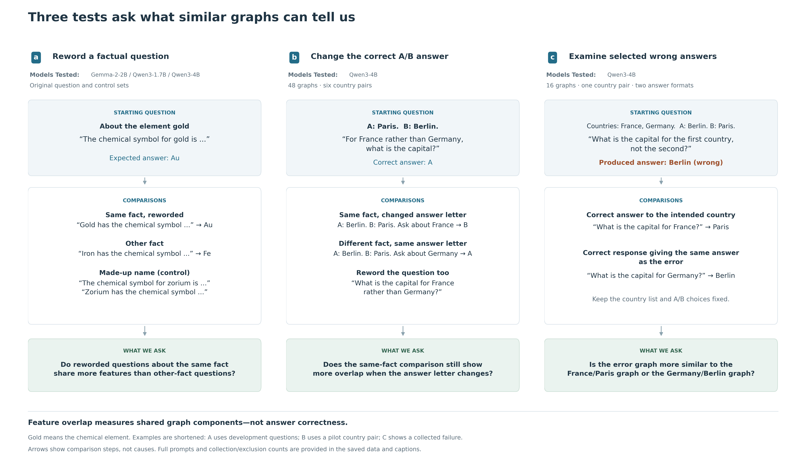

**Figure 1. Three tests ask what similar graphs can tell us.** A, Compare a question with a reworded question about the same fact and with questions about other facts. Comparisons stay within the same subject and evaluation group. Gold means the chemical element, not an ideal or gold-standard question. The gold, iron, and made-up-name examples come from the development questions, not the test questions plotted in Figure 2. The original samples cover three models, with different subjects available in each. B, In Qwen3-4B, keep the same words and token counts within each country pair, but change which country is asked about, which capital is assigned to A or B, and the wording. This tests whether questions about the same fact still share more features when the correct A/B answer changes. All 48 predicted answer letters were correct. The France/Germany example illustrates the design using a pilot pair, not an additional test pair. Displayed examples are shortened; full prompts preserve both country names and all other words within a pair. Word order and the role of each country still differ, so this does not isolate meaning alone. C, Compare a selected wrong-answer graph with two correct-answer graphs: one answering the intended country and one producing the same answer as the error. This Qwen3-4B study contains 16 graphs from one country pair and two answer formats, not 16 independent tests. Arrows show comparison steps, not causes. Box colors identify labeled steps, not quantities. Collection counts, exclusions, and failed preliminary checks are reported separately.

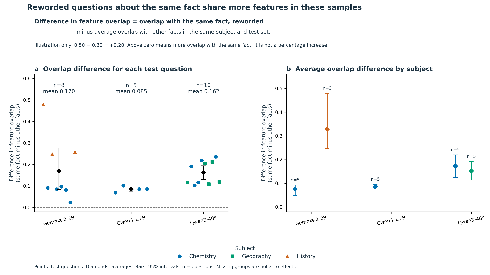

**Figure 2. Reworded questions about the same fact share more features in these samples.** A, Each point represents one test question that passed the fixed inclusion rules. A test question was reserved for evaluation, rather than for developing the analysis. The difference in feature overlap is the overlap with a reworded version of the same fact minus the average overlap with reworded questions about other facts in the same subject and test set. For illustration only, 0.50 overlap with the same fact minus 0.30 average overlap with other facts gives a difference of +0.20. These example numbers are not measured results. A positive difference means more overlap with the same fact, zero means equal overlap, and a negative difference means more overlap with the other-fact questions. The difference is not a percentage increase. B, The same measure is averaged separately by subject. Colors and shapes identify subjects; diamonds show model averages. Bars are saved 95% bootstrap intervals, obtained by resampling questions 10,000 times. n counts questions, not graph pairs. Averages are 0.170 for Gemma-2-2B (8 questions), 0.085 for Qwen3-1.7B (5), and 0.162 for Qwen3-4B (10). The same facts recur across models, and subject coverage differs, so these results do not rank the models. Shared words and shared answers remain possible explanations. Missing subject groups are unavailable comparisons, not zero effects. *The original Qwen3-4B collection is incomplete: 145 of 147 planned graphs are available.

### 3.2 Equal-feature-count sampling preserves pooled direction, not every fact

| Pipeline | Original mean | Equal K mean (descriptive 95% interval) | Equal K/2 mean | Positive averaged facts at K |
|---|---:|---:|---:|---:|
| Gemma-2-2B | 0.170 | 0.149 [0.066, 0.257] | 0.058 | 7/8 |
| Qwen3-1.7B | 0.085 | 0.081 [0.069, 0.094] | 0.032 | 5/5 |
| Qwen3-4B, incomplete | 0.162 | 0.126 [0.084, 0.168] | 0.051 | 10/10 |

All pooled means remained positive in every one of the 200 repetitions of each variant. Gemma's tungsten fact reversed to an averaged margin of -0.0187 at K and -0.0080 at K/2. Thus it would be incorrect to say every fact remains positive across sensitivities. Thinning changes the scale of Jaccard; the reductions must not be interpreted as percentages of the original effect explained by size.

The earlier centered OLS intercept is not independent evidence against size confounding: with centered predictors and an intercept, it equals the original sample mean by construction. The subsampling analysis supplies a more direct but still limited cardinality check.

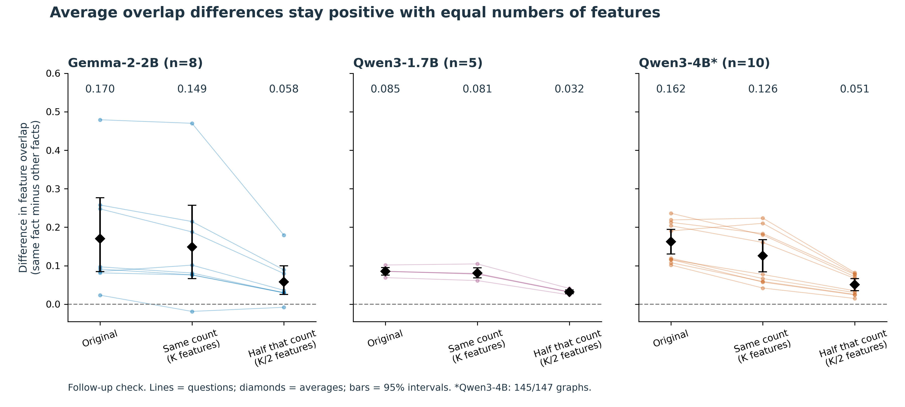

**Figure S3. Average overlap differences stay positive with equal numbers of features.** The difference in feature overlap is same-fact overlap minus average other-fact overlap within the same subject and test set. Within each model, subject, and test set, randomly sample the same number of features from every graph. K is the number of features in the smallest graph in that group; the second check uses half that number, rounded down. Repeat 200 times, reusing each sampled graph across comparisons within a repetition. Lines show individual test questions; diamonds show averages. Bars are descriptive 95% bootstrap intervals from resampling questions, not from the 200 feature samples. Seven of eight Gemma questions and all included Qwen questions retain positive average differences. Equalizing counts does not remove differences in shared words, answers, or which features the exporter retains. A smaller overlap score after sampling is not a percentage of signal explained. *Qwen3-4B remains incomplete (145/147 graphs).

### 3.3 There is no support for the declared word-matched comparison

No held-out fact had an other-fact comparator under any of the three lexical/joint rules: 0/8 Gemma, 0/5 Qwen3-1.7B, and 0/10 Qwen3-4B. Even the most word-overlapping other-fact prompt was at least 0.196 below the own paraphrase in Gemma and Qwen3-1.7B, and at least 0.181 below it in Qwen3-4B. This is not a borderline caliper result.

None of the 86 directed other-fact comparisons shared the expected answer, whereas own-fact pairs did. Fact identity therefore co-varies with both greater word overlap and expected-answer identity. A lexical- and answer-independent semantic effect is not identifiable from these controlled comparisons. This does not prove that shared words explain the entire observed signal; it means the dataset cannot adjudicate that explanation.

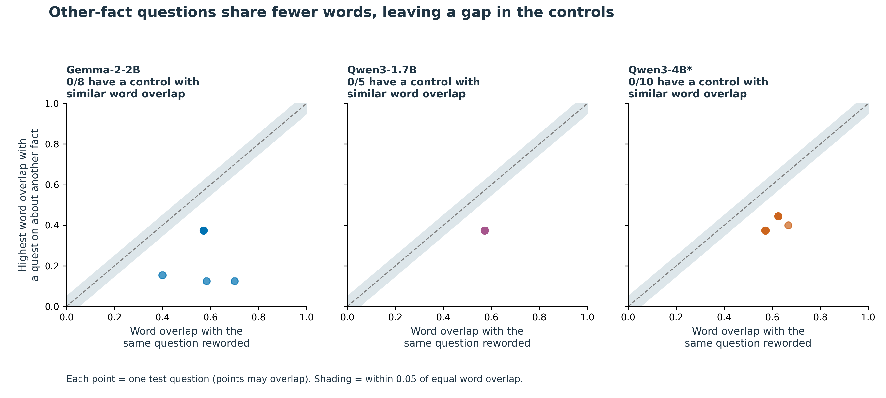

**Figure S4. Other-fact questions share fewer words, leaving a gap in the controls.** For each test question, compare word overlap with its same-fact rewording (horizontal axis) against the highest word overlap with any other-fact rewording (vertical axis). Word overlap uses unique letter/number words, ignores letter case, and keeps common words. Both axes use Jaccard overlap: shared words divided by all distinct words across the pair. The dashed line means equal overlap; the shaded band allows a difference of 0.05 in either direction. Every other-fact comparison falls below that band. Thus 0/8 Gemma, 0/5 Qwen3-1.7B, and 0/10 Qwen3-4B questions have a comparison meeting the specified word-matching rule. None qualifies under the alternative at-least-as-much-word-overlap rule or the joint word/feature-count rule either. This is a missing comparison, not a measured zero effect or proof that words explain all feature overlap. Same-fact questions also share their expected answer, so the data do not isolate meaning from words or answers. *Qwen3-4B remains incomplete (145/147 graphs).

### 3.4 Some excluded Qwen outputs are partial answers, while crossed output support is narrow

Among 30 available original Qwen3-1.7B factual prompt graphs, 28 had whole expected-answer next-token matches; the two mercury outputs were compatible `H` prefixes of `Hg`. Among 59 available Qwen3-4B factual graphs, 49 had whole-answer next-token matches, five were compatible substantive prefixes, and five produced a different next token under the audited expected-string conventions. The five prefixes were mercury target/paraphrase (`H`), Berlin Wall target/paraphrase (`G` for `Gorbachev`), and the French Revolution paraphrase (`Bast` for `Bastille`). No subsequent-token generation is archived to verify their completed answers.

These classifications do not establish semantic error for every different token: for example, a continuation beginning `African` could require full-answer adjudication against an expected acronym. Primary eligibility is unchanged, and these graphs are not added to the confirmatory sample.

Strict crossed expected-token agreement was 7/9, 4/9, and 0/9 for Gemma chemistry, geography, and history; corresponding Qwen3-4B counts were 8/9, 9/9, and 0/9. Eight Qwen3-4B crossed outputs were whitespace-only compatible continuations, not substantive answer retrieval. Only Qwen3-4B geography qualified as a fully balanced strict-output subset. There, binary fact and wording effects were 0.1014 and 0.1063: close point estimates from one small domain, without a formal dominance test.

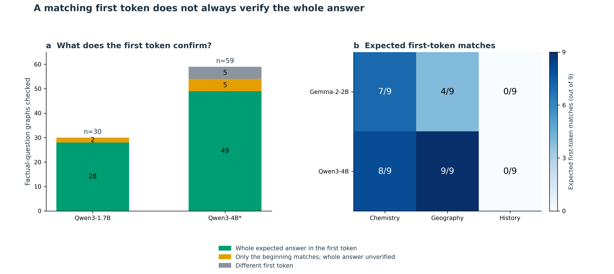

**Figure S5. A matching first token does not always verify the whole answer.** A, Audit the first predicted text unit, or token, using the Qwen tokenizers. Green means the whole expected answer fits in that token; yellow means it is only a compatible beginning, so the completed answer is unverified; gray means a different token. Seven apparent mismatches across the two Qwen models are compatible beginnings of multi-token answers. Counts include development and test factual questions, including Qwen3-1.7B geography questions without complete controls; they are not the question counts in Figure 2. Qwen3-4B is missing one factual graph and one made-up-name graph. Official Qwen tokenizer versions agree with all saved prompt pieces and decoded top tokens, but the exact versions used at the time of graph collection cannot be fully recovered. Gemma tokenizer access was denied, leaving that audit unresolved. B, In the fact/wording experiment, counts use the original exact first-token matching rule after trimming whitespace; that rule is unchanged. Only Qwen3-4B geography matches in all nine questions. Its fact/wording differences are 0.101/0.106, which do not establish that either factor dominates. A zero in history means zero matches under this rule, not zero history knowledge. *The original Qwen3-4B collection is incomplete.

### 3.5 Wording and nonce effects depend on cohort and pipeline

The unfiltered crossed fact/wording effects were 0.074/0.118 in Gemma and 0.101/0.064 in Qwen3-4B. Influence-weighted effects had the same within-pipeline ordering (0.090/0.114 and 0.105/0.075). The differing pooled ordering cannot establish a statistically significant model difference, particularly given the output findings above.

Broad-token-class-matched same-template nonce margins were -0.069 (Gemma, n=2), -0.014 (Qwen3-1.7B, n=4), and +0.096 (Qwen3-4B, n=10). Paraphrased nonce margins were positive in all three cohorts. The original claim that retaining a template universally erases the factual paraphrase advantage is therefore unsupported.

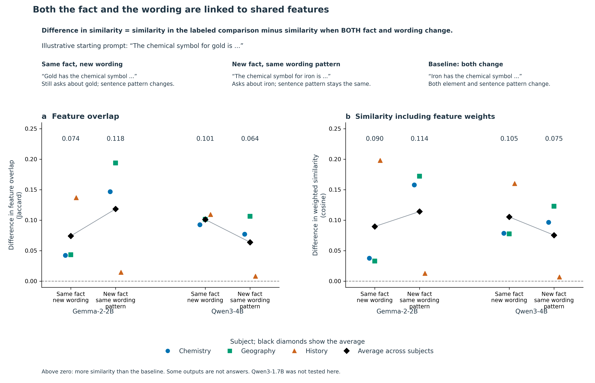

**Figure 3. Both the fact and the wording are linked to shared features.** A, Difference in feature overlap. B, Difference in similarity when each feature is weighted by its saved graph-influence score (cosine similarity, which compares the direction of the weighted feature vectors). For both panels, the baseline is a pair of questions differing in both fact and wording. The same-fact comparison changes the wording; the same-wording comparison changes the fact. For example, compare “The chemical symbol for gold is ...” with “Gold has the chemical symbol ...” to keep the fact but change the wording. Compare the starting prompt with “The chemical symbol for iron is ...” to keep the wording pattern but change the fact. Compare it with “Iron has the chemical symbol ...” to change both: this is the baseline. These examples illustrate the comparisons. “Same wording” means the same sentence pattern, not an identical prompt; the element name must change. Each difference is similarity in the labeled comparison minus similarity in that baseline, calculated within each subject. Panel A counts which features are shared; panel B also considers their saved influence weights. Neither panel directly measures correctness. Each model has 27 graphs: three facts, three wordings, and three subjects. Colored points are subject averages; black diamonds average the subjects equally. Lines connect descriptive estimates, not confidence intervals. Average fact/wording differences in A are 0.074/0.118 for Gemma-2-2B and 0.101/0.064 for Qwen3-4B. Some first predicted tokens are incomplete answers or not answers at all. Only Qwen3-4B geography matches the expected first token in all nine questions; its fact/wording differences are 0.101/0.106. These results do not establish that one factor dominates or that one model is better. Qwen3-1.7B was not tested in this design.

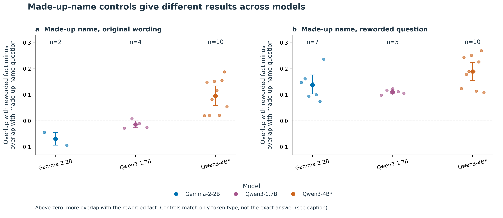

**Figure 4. Made-up-name controls give different results across models.** Replace the real name in a question with a made-up name, either keeping the original wording (A) or rewording the question (B). For each target question, subtract its overlap with the made-up-name version from its overlap with a reworded factual version. Above zero favors the factual version; below zero favors the made-up-name version. Colors identify models, points represent test questions, diamonds show averages, and bars are saved 95% bootstrap intervals from resampling questions. n counts included questions. The controls match only the kind of first token: letters/numbers, whitespace, or punctuation/symbols. They do not match the exact answer, its meaning, confidence, or correctness. Averages in A are -0.069 (2 questions), -0.014 (4), and +0.096 (10) for Gemma-2-2B, Qwen3-1.7B, and Qwen3-4B. Small samples and different subject coverage prevent a general claim that wording explains the original result. *The original Qwen3-4B collection is incomplete (145/147 graphs).

### 3.6 Export quality remains a secondary limitation

Ambiguous IDs occurred in 84/120 original Gemma controlled exports and 13/27 Gemma crossed exports; none were detected in 50 original Qwen or 145 available Qwen3-4B exports. Reconstruction-error node influence remains nonzero: median fractions were approximately 7.15%, 5.76%, and 14.52% in the respective controlled cohorts. These are audit-defined fractions of absolute nonterminal influence, not causal percentages of an answer explained. The clean-export Gemma held-out sensitivity has only two facts.

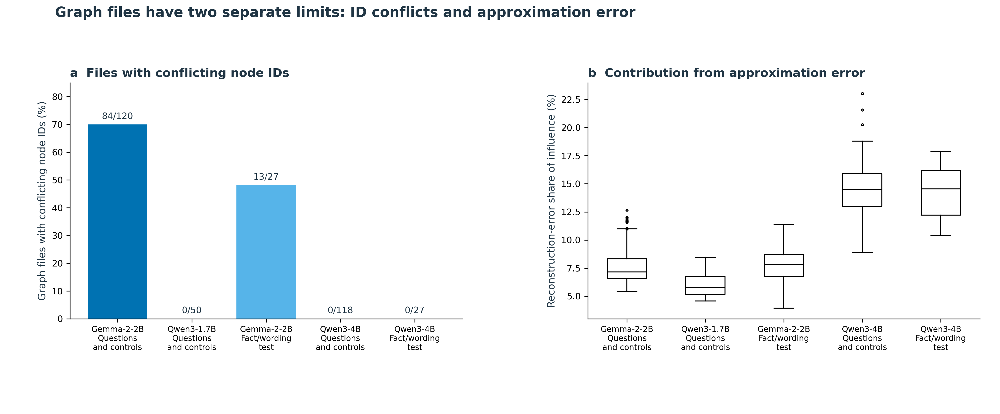

**Figure S1. Graph files have two separate limits: ID conflicts and approximation error.** A, The percentage of saved raw graph files in which the same node ID refers to conflicting node identities. Labels show affected files over files checked. Zero means no conflict was detected, not no graphs or no model errors. The original question sets include factual questions and controls; the fact/wording sets vary both factors. B, Reconstruction-error nodes record part of the model computation not captured by the feature approximation. The axis gives their share of absolute nonterminal-node influence, using the saved audit definitions. This is not the percentage of wrong answers or of reasoning explained. Box centers mark medians; boxes span the middle 50%, whiskers extend to values within 1.5 box lengths, and dots show values beyond the whiskers. Original distributions use raw-file audits; Qwen3-4B uses converted graphs with no ambiguous IDs removed. Differences combine model, exporter, and approximation choices; they do not isolate model size or architecture.

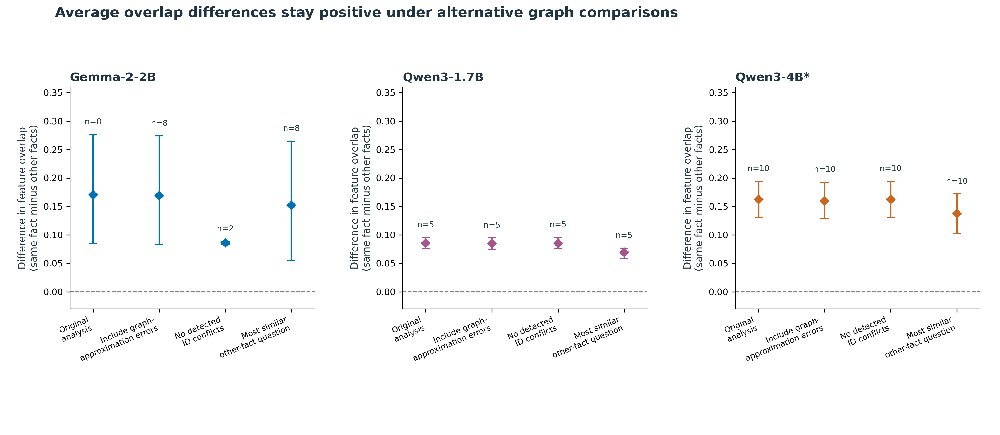

**Figure S2. Average overlap differences stay positive under alternative graph comparisons.** The difference in feature overlap is same-fact overlap minus other-fact overlap, using the comparison specified for each check. Compare the original analysis with three alternatives: include reconstruction-error nodes; use only files without detected node-ID conflicts; or compare with the most similar other-fact question rather than the average other-fact question. Reconstruction-error nodes represent approximation error, not wrong model answers. Points are saved averages; bars are 95% bootstrap intervals from resampling test questions. n counts questions. Restricting files requires rebuilding the comparison groups and leaves only two Gemma questions, so that positive result is weak evidence on its own. The size-regression intercept is not plotted: with centered predictors it equals the unadjusted mean and is not an independent check. *Qwen3-4B remains incomplete (145/147 graphs).

### 3.7 Stronger controls reveal a small fact association and substantial answer dependence

All 48 held-out matched-choice decisions agreed with the intended A/B label, and all exports passed the recorded identifier and checksum checks. The balanced same-fact Jaccard contrast was 0.0303 (95% block-bootstrap interval 0.0265–0.0338), positive in each of six country-pair blocks. The exact conditional correspondence p-value was 0.000244141, or 0.000732422 after the prespecified three-opportunity adjustment. These results belong to the separate Qwen3-4B follow-up, not to three-model replication of this control.

The descriptive output-label contrast was 0.2827. More importantly, the fact-associated contrast was 0.0628 when the output label was preserved but -0.0022 when it changed. The latter is a near-zero point estimate, not an equivalence result. The positive balanced contrast therefore does not establish an answer-independent fact representation. Nor does the larger output contrast quantify variance explained: the contrasts use different comparison structures, and answer mapping and entity-role binding remain relevant alternatives.

The exploratory direct paired difference between these two components was 0.0650 Jaccard units across six blocks (95% block-bootstrap interval 0.0582–0.0715; Student-t interval 0.0553–0.0746; two-sided block sign-flip p=0.03125). All six differences were positive. The difference remained 0.0720 after excluding final-position feature nodes, 0.0688 after excluding the last quarter of observed feature layers, and 0.0732 after both filters. Thus the measured contrast is not confined to the removed nodes, but these observational filters do not establish answer-independent processing elsewhere in the model. See Supplement Figure S6 and the saved-data audit.

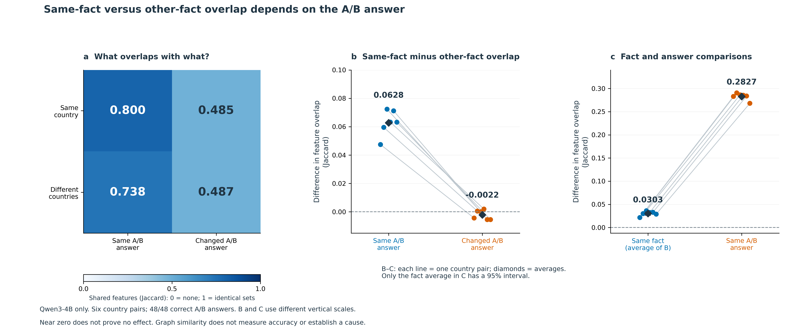

**Figure 5. Same-fact versus other-fact overlap depends on the A/B answer.** Qwen3-4B only: six country pairs and 48 correct predicted A/B answers. This follow-up was designed after earlier results were seen; its rules were fixed before collection. The words and token counts are identical within each country pair. A, Average overlap for questions asking about the same or different countries and producing the same or different A/B letters. All comparisons change the wording. The four averages are 0.8005, 0.4853, 0.7377, and 0.4874, read row by row. The color scale runs from no shared features (0) to identical feature sets (1); it is not an accuracy scale. B, Subtract different-country overlap from same-country overlap, separately when the answer letter stays the same or changes. The averages are 0.0628 and -0.0022. Their paired difference is 0.0650 (exploratory Student-t 95% interval 0.0553–0.0746; two-sided sign-flip p=0.03125, assuming independent country pairs and symmetric differences under the null). C, Average the two fact differences in B: 0.0303, with a saved 95% bootstrap interval of 0.0265–0.0338. For comparison, overlap with the same answer letter minus overlap with a different letter is 0.2827, averaged across same- and different-country comparisons. Each line in B–C represents one country pair; diamonds mark averages. Only the fact average in C has an interval drawn. Colors identify the labeled categories; B and C have different vertical scales. Six country pairs—not 48 graphs or 4,096 possible reassignments in the earlier null test—supply the independent units assumed by the statistical tests. A near-zero estimate does not prove no effect. These differences are not fractions of reasoning explained and do not establish a cause. Word order and country roles remain possible explanations. Supplement S6 checks whether the differences remain after excluding some features.

### 3.8 The position-balanced pilot fails its behavioral gate

The new ordinal-selection pilot produced 8/16 correct A/B decisions. Under the frozen stopping rule, no held-out graph cohort was generated for that experiment. A local audit found no expected-answer, submitted-prompt, token-sequence, or top-token decoding mismatch. The subsequent 20-preview diagnostic passed all four literal/replay checks. Its eight named-country prompts produced the intended next token, whereas its eight ordinal prompts did not, across both response formats. This pattern implicates the ordinal formulation in the tested setup without identifying its internal cause. It does not negate the earlier matched-choice finding or establish that the proposed position-balanced graph effect is zero.

### 3.9 Failure graphs resemble correct responses with the same answer

All 16 diagnostic graphs passed integrity checks and reproduced their archived preview answers. Thus all eight ordinal errors persisted, all eight named-country controls remained correct, and all eight comparison triples met the clean-export and output-matching requirements. In every triple, the failure graph shared more features with the correct same-output response than with the correct intended-country response (Figure 6). The mean same-output minus same-country Jaccard difference was 0.1983 for A/B responses and 0.2649 for capital-name responses. Equal-feature-count sensitivities retained differences of 0.1851 and 0.2361, respectively; influence-weighted cosine preserved the direction in all eight triples. These are dependent descriptive comparisons, not eight independent replications.

For example, with options “A: Berlin. B: Paris” and countries “France, Germany,” asking for the first country's capital produced A or Berlin, depending on the response format. Naming France instead produced B or Paris; naming Germany produced A or Berlin. The wrong response therefore resembled the correct response sharing its output, not the correct response to the intended country. This is compatible with answer-conditioned structure and does not, by itself, identify a shortcut.

The graph-location audit preserved the same-output advantage in every selected comparison under all three filters. Removing both final-position nodes and the last quarter of observed feature layers gave mean differences of 0.2053 for labels and 0.2608 for capital names. This rules out confinement of the observed difference to those removed node sets, not output conditioning of the remaining graph (Supplement Figure S6).

An additional inspection of token-location summaries provided a narrower clue. In all four capital-name failures, feature sources at the wrong country's name in the list had 4.9–14.6 times the absolute direct incoming weight of sources at the intended country's name. In all four named-country capital controls, the intended country's name had greater weight. The corresponding A/B summaries did not exhibit a consistent wrong-country dominance. This format-dependent observation is compatible with incorrect reference selection, but token location does not establish feature semantics or causal necessity.

The graphs also leave substantial uncertainty. Reconstruction-error sources accounted for a median 23.1% of absolute direct incoming weight to the observed logit across the 16 graphs (range 17.2–31.4%). The intended correct logit was absent from all eight failure exports, so its attribution is unavailable rather than zero. Most displayed nodes occur at late layers near the answer-generation position; a “chat frame” location label does not imply a formatting mechanism. Crucially, these selected layouts confound choosing the answer option at the requested position with choosing the country named by the excluded ordinal in phrases such as “first country, not the second.” Position matching and mishandled negation therefore remain observationally indistinguishable in this batch.

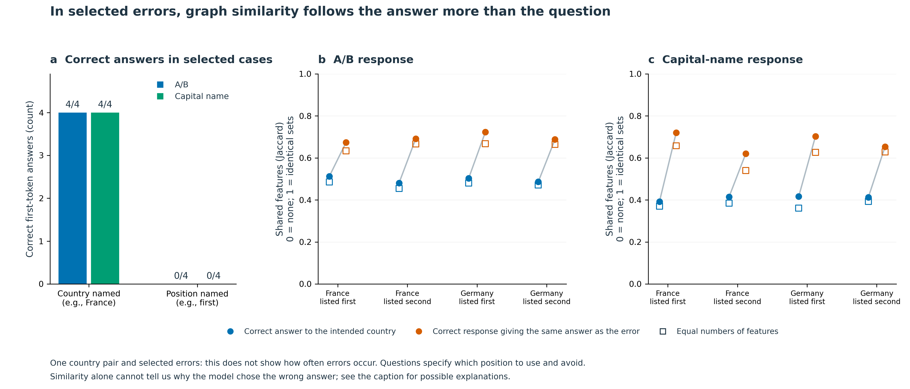

**Figure 6. In selected errors, graph similarity follows the answer more than the question.** A, In 16 new Qwen3-4B graphs, all eight questions naming the country are answered correctly and all eight selected questions referring to its position reproduce the error. Each answer format has four correct and four wrong responses. These selected cases do not estimate how often the model makes errors in general. B–C, Compare each wrong-answer graph with a correct response to the intended country (blue) and a correct response giving the same answer as the error (orange). The country-list order and A/B assignments stay fixed. For example, with France first and A: Berlin, B: Paris, an indirect question about France produces Berlin. Naming France produces Paris; naming Germany produces Berlin. The error graph is more similar to the Germany/Berlin graph. Circles use all retained features; open squares use equal numbers of randomly sampled features, averaged over 200 repetitions. Lines connect comparisons for the same error. The same-answer minus intended-country overlap averages 0.1983 for A/B answers and 0.2649 for capital names (0.1851 and 0.2361 after equalizing feature counts). All 16 exports and eight three-graph comparisons pass the file-integrity and output checks. The cases share one country pair and overlapping controls, so no population confidence intervals or confirmatory p-values are shown. These comparisons do not keep the exact words constant. Confusing list positions, mishandling negation, or graph structure tied to the produced answer remain possible explanations—not established causes. The correct-answer output node is missing from each error graph; its contribution is unknown, not zero.

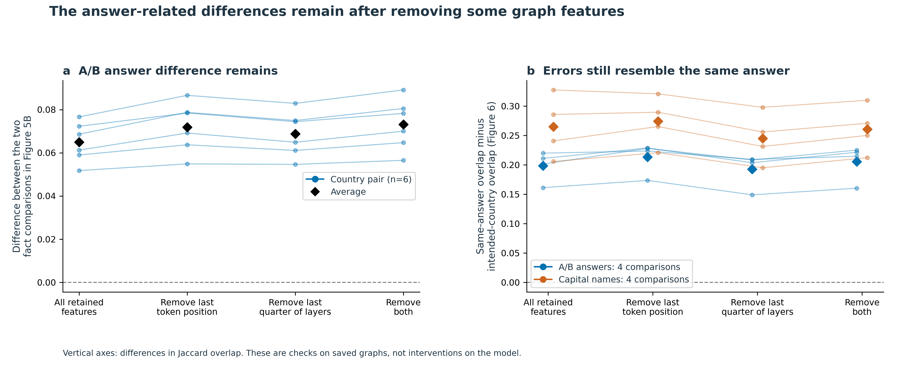

**Figure S6. The answer-related differences remain after removing some graph features.** Qwen3-4B only. Repeat the saved comparisons after removing features at the last token position, in the last quarter of observed feature layers, or both. Removal happens before combining feature identities across positions. A, Plot the difference between the same-letter and changed-letter fact comparisons in Figure 5B. Each line represents one of six country pairs; black diamonds show averages. B, Plot overlap with the correct same-answer response minus overlap with the correct intended-country response in the selected errors from Figure 6. Lines show the individual comparisons; colored diamonds show format averages. All filtered feature sets are nonempty. Zero means equal overlap, not missing data. These checks were chosen after seeing earlier results. No confidence intervals or new population tests are attached. Removing features from saved graphs is not an intervention on the model and does not establish a cause. The remaining graphs are still constructed around the answer being produced.

### 3.10 The final history pilot does not support launching its graph cohort

The fixed 20-preview pilot finished with 15 correct top-label decisions: 4/4 literal A/B instruction checks, 7/8 document-history cells, and 4/8 spaceflight-history cells. All normalized returned prompts matched the submitted prompts, and server token inventories matched within each historical block. The protocol required 20/20 correct decisions, so no evaluation graphs were requested and the planned historical graph-overlap contrast was not measured.

The document-history error occurred when A represented 1783 and B represented 1776: the question asked for the year of adoption of the US Declaration of Independence, with the Treaty of Paris as context, but the top label was A. Reversing question/context order in that mapping returned B. Such variation does not establish a specific causal failure mechanism or absence of historical knowledge. The two selected pilot pairs are not a history-accuracy benchmark. This outcome limits the available replication rather than revising the earlier graph results; the original history exclusions remain unchanged.

| Pilot component | Correct top labels | Fixed requirement | Outcome |
|---|---:|---:|---|
| Literal A/B instructions | 4/4 | 4/4 | Passed |
| Declaration of Independence and Treaty of Paris | 7/8 | 8/8 | Failed |
| Sputnik 1 and Explorer 1 launch years | 4/8 | 8/8 | Failed |
| Entire pilot | 15/20 | 20/20 | No evaluation graphs requested |

## 4. Discussion

The robust starting observation is a feature-overlap association between targets and their own paraphrases in selected model-pipeline cohorts. Reconstruction from raw files and repeated cardinality equalization strengthen confidence that this association is present in the archived data. They do not identify its semantic cause. The original cohorts lack word-matched comparators and separate expected answers perfectly between own-fact and other-fact comparisons. The matched-choice follow-up addresses part of that problem: it preserves token inventories and crosses answer labels, retaining a small balanced fact association. Its conditional components nevertheless do not demonstrate answer-independent factual overlap.

The crossed and nonce results likewise should not be reduced to a universal ordering of fact and wording. Their effects vary by domain and pipeline, output predictions are often mismatched or incomplete, and the single fully balanced strict-output domain has similar fact and wording estimates. The study is observational: no interventions test feature necessity or sufficiency.

The failure-case analysis extends this measurement argument rather than introducing a separate mechanism claim. Output-associated similarity also occurs when the requested fact is answered incorrectly. A graph's resemblance to a correct graph is therefore insufficient evidence of correct factual processing unless the compared prompts, answers, and behavioral outcomes are accounted for. The capital-name token-location pattern nominates incorrect reference selection as a hypothesis, but output conditioning, position matching, and negation handling remain alternatives. Fixed-attention attribution graphs also need not explain how the relevant attention pattern arose [1]. Prior work already establishes selection and positional-retrieval vulnerabilities [5,7]; our contribution is their relevance to interpreting this graph-overlap measurement, not priority for discovering those vulnerabilities.

The diagnostic does not require a causal explanation to serve this narrower role in the paper. A stronger mechanism claim would require a separately specified study separating ordinal reference from negation, independently permuting list and option positions, and testing held-out entities. Causal interventions would be needed to establish necessity or sufficiency of nominated features. Full-answer behavior and independent hosted reproduction would further delimit the next-token and deployment-specific interpretation. These are optional extensions for stronger claims, not completed evidence or changes to existing eligibility rules.

The contribution is consequently a bounded evaluation of a graph-overlap measurement under progressively stronger comparator controls. It is not a validation of semantic factual circuits or a claim of priority for discovering prompt dependence.

## 5. Conclusion

Same-fact paraphrases show a positive feature-set overlap advantage in the eligible archived cohorts. Stronger Qwen3-4B controls retain a small balanced fact-associated contrast, but the association depends on whether the answer label is preserved. Selected failure cases extend that boundary: incorrect responses resemble correct same-output responses more than correct intended-country responses. Together, the findings support attribution-graph feature overlap as a prompt- and answer-conditioned measurement. It is not, on its own, a test of correct factual processing or evidence of a prompt-invariant semantic circuit.

## Reproducibility and availability

The September plan is `EXPLORATORY_CONFOUND_CHECKS_20260905.md`. The CPU-only analysis and plotting scripts are `scripts/exploratory_confound_checks.py` and `scripts/plot_exploratory_confound_checks.py`. Their results, input hashes, tokenizer revisions, per-graph/pair/fact tables, subsampling repetitions, logs, and SVG/PNG figures are saved under `data/model_extension/exploratory_20260905`. The original primary files and earlier six-figure package are preserved. The new analyses do not constitute a clean-room rerun of every original estimator.

No data were published or submitted externally. The working data are local and excluded from ordinary Git tracking; an immutable, appropriately licensed data/code deposit and independent clean-checkout reproduction remain required. An isolated Python 3.13.3 environment without system-site-packages reproduced all 23 original fact margins from the available raw exports and matched the October closeout audit exactly. This was a same-machine computational check, not independent human validation, hosted-model replication, or a rerun of every historical estimator. Human authors must review scientific claims and references. Codex assisted with code, audit, analysis, figures, and drafting; that assistance does not substitute for independent validation.

The October closeout audit is generated by `scripts/audit_paper_closeout.py` under `data/model_extension/final_closeout_20261005`; it reconstructs the archived matched-choice and failure contrasts from hash-verified saved graphs. The final history protocol is `HISTORY_CHOICE_FINAL_PROTOCOL.md`, with fixed design, runner, and analyzer in `scripts/history_choice_closeout.py`, `scripts/run_history_closeout.py`, and `scripts/analyze_history_closeout.py`. Its prompts, local freeze, request records, checksums, and outcomes are maintained separately under `data/model_extension/history_choice_final_v1`. `requirements-closeout.txt` specifies direct dependencies; the resolved package versions, test logs, and `verification.json` are saved under the closeout `reproduction` directory by `scripts/reproduce_closeout.py`. The isolated same-machine reproduction reconstructed all 23 original primary margins from 342 checksum-verified available raw graphs, matched the closeout audit, and passed 82 software tests. A separate terminal-pilot validator reconstructed the 15/20 gate from archived responses, checked frozen hashes and the shared request ledger, and confirmed that no evaluation graphs were generated. These checks are not independent human review or a fresh reproduction of hosted model outputs.

The matched-choice follow-up is documented in `MATCHED_CHOICE_CHAT_V2_PROTOCOL.md` and `MATCHED_CHOICE_RESULTS_FOR_MANUSCRIPT.md`; its archived inputs, block-level results, and figures are under `data/model_extension/matched_choice_chat_v2`. The failed position pilot is documented in `MATCHED_CHOICE_POSITION_V3_PROTOCOL.md`. Its diagnostic audit remains under `data/model_extension/position_artifact_diagnostic_20261001`.

The failure graph protocol is `FAILURE_CASE_GRAPH_ANALYSIS_PLAN.md`. All 16 raw exports, metadata, code snapshots, hashes, audits, converted node/edge tables, role summaries, comparison values, and PNG/SVG figures are under `data/model_extension/failure_case_graphs_v1`. The saved-data analysis, figure, and validation entry points are `scripts/analyze_failure_case_graphs.py`, `scripts/plot_failure_case_graphs.py`, and `scripts/validate_failure_case_graphs.py`. The descriptive country-location ratio divides `absolute_weight` for feature sources at the other country's list occurrence by the corresponding weight at the intended country's occurrence in each capital-name graph's `source_role_totals.csv`. The four failure ratios are 4.919, 8.773, 13.567, and 14.630 approximately; the unrounded tables are authoritative. This manuscript integration changes no frozen estimates or analysis files.

## References used in this revision

1. Ameisen, E., Lindsey, J., Pearce, A., et al. (2025). *Circuit Tracing: Revealing Computational Graphs in Language Models*. [Methods](https://transformer-circuits.pub/2025/attribution-graphs/methods.html).
2. Franco, G., Tassis, L. M., Rohr, A., and Crovella, M. (2026). *Finding Interpretable Prompt-Specific Circuits in Language Models*. [arXiv:2602.13483](https://arxiv.org/abs/2602.13483).
3. Qwen. Official [Qwen3-1.7B tokenizer configuration](https://huggingface.co/Qwen/Qwen3-1.7B/blob/main/tokenizer_config.json) and [Qwen3-4B tokenizer configuration](https://huggingface.co/Qwen/Qwen3-4B/blob/main/tokenizer_config.json). Actual downloaded revisions and file hashes are in the audit artifacts.
4. Hugging Face. [Tokenizer encoding and decoding API](https://huggingface.co/docs/tokenizers/api/tokenizer). Google. [Gemma-2-2B repository](https://huggingface.co/google/gemma-2-2b).

5. Zheng, C., Zhou, H., Meng, F., Zhou, J., and Huang, M. (2024). *Large Language Models Are Not Robust Multiple Choice Selectors*. ICLR. [arXiv:2309.03882](https://arxiv.org/abs/2309.03882).
6. Wang, X., Ma, B., Hu, C., et al. (2024). *“My Answer is C”: First-Token Probabilities Do Not Match Text Answers in Instruction-Tuned Language Models*. [arXiv:2402.14499](https://arxiv.org/abs/2402.14499).
7. Zhang, Z., Xiong, H.-D., Wilson, R. C., Aoi, M., Mattar, M. G., and Ji-An, L. (2026). *The Position Curse: LLMs Struggle to Locate the Last Few Items in a List*. [arXiv:2605.07127](https://arxiv.org/abs/2605.07127).

The bibliography is deliberately restricted to sources used here and is not a complete literature review. The unresolved reference in the July manuscript is not relied on in this revision.
